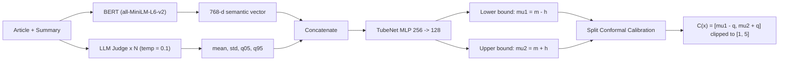
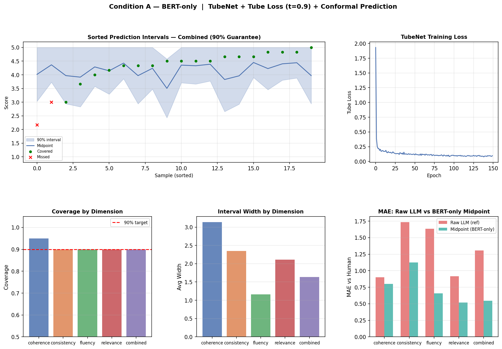
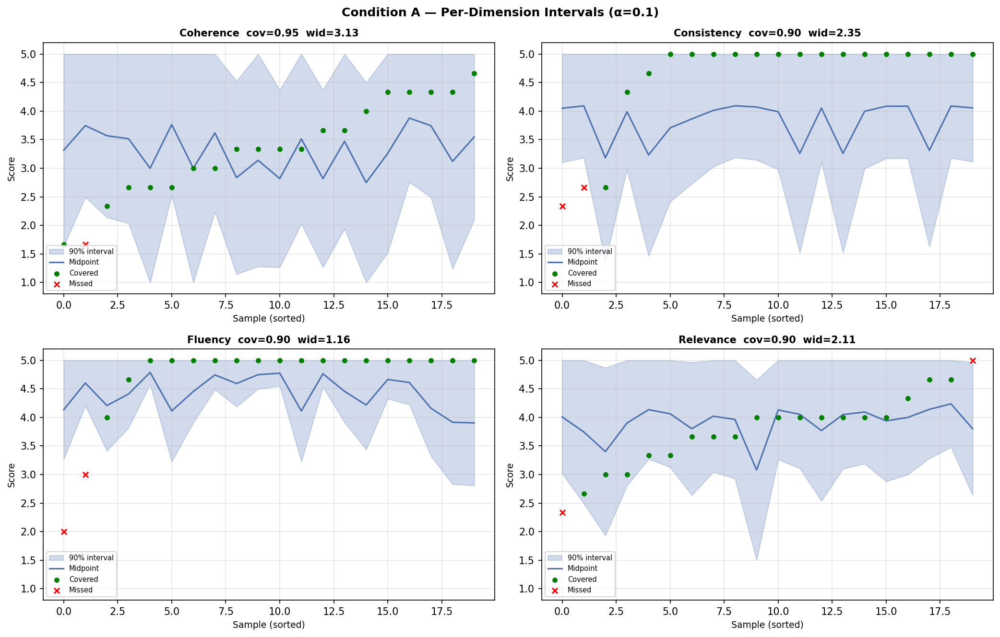
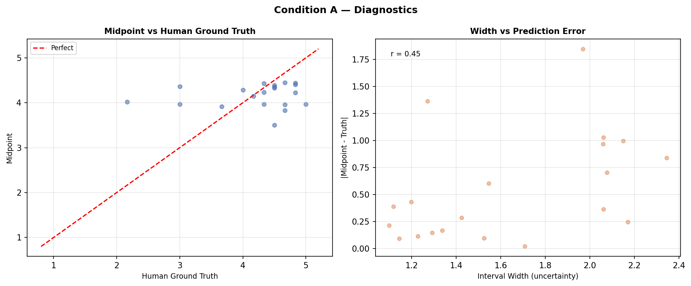
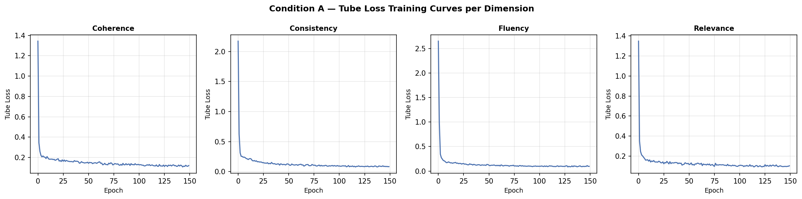

<h1 align="center">TubeNet: Quantifying Uncertainty in LLM-as-a-Judge</h1>

<p align="center"><b>Calibrated Prediction Intervals for LLM Evaluation with Tube Loss &amp; Conformal Prediction</b></p>

<p align="center">
  
  
  
  <a href="https://github.com/ltpritamanand/Tube_loss"></a>
</p>

<p align="center"><i>Prince Chovatiya, Nakul Patel, and Pritam Anand</i><br>
Dhirubhai Ambani University, Gandhinagar, India</p>

---

> ### TL;DR
>
> LLM judges return a single number (`4`) that hides how uncertain they really are.
> This project wraps a **Tube Loss-trained interval network (TubeNet)** around the judge
> and adds **conformal calibration**, turning point scores into **provably valid ≥90% prediction intervals**.
>
> **Best configuration (Condition C2 + Boosted CQR):** ≥90% coverage on all 4 evaluation dimensions,
> interval width reduced by up to **87%** vs. the BERT-only baseline, and outperforms
> Sheng et al. (EMNLP 2025) in **27 of 28** method–dimension comparisons.

| At a glance | |
|---|---|
| **Coverage target** | ≥ 90% (marginal, distribution-free) |
| **Best configuration** | Condition C2 + Boosted CQR |
| **Width reduction vs. BERT-only** | up to **−87%** (Consistency) |
| **Head-to-head vs. prior art** | **27/28** method–dimension wins |
| **Judges evaluated** | 5 LLMs via Groq API |
| **Benchmark** | SummEval (N = 200, 4 dimensions) |

---

## Where This Fits: The Tube Loss Family

This folder is the newest member of the [**Tube Loss**](https://github.com/ltpritamanand/Tube_loss) repository,
which studies one idea — the Tube Loss objective for prediction interval estimation — across very different domains:

| # | Folder | Domain |
|---|---|---|
| 1 | Tube Loss ANN | Regression / PI estimation |
| 2 | Tube Loss Kernel Machine | Kernel methods |
| 3 | Tube Loss DL Probabilistic Forecasting | Deep forecasting (GRU / LSTM / TCN) |
| 4 | Electric Load Forecasting Application | Energy |
| 5 | Wind Probabilistic Forecasting Application | Renewable energy |
| 6 | A Vanilla Extension of the Conformal Regression | Conformal prediction |
| **7** | **TubeNet: Quantifying Uncertainty in LLM-as-a-Judge** ★ | **LLM evaluation / NLP** |

> **Broad impact.** The same Tube Loss objective — originally designed for probabilistic forecasting —
> is shown here to work for a completely different problem: quantifying the uncertainty of LLM judges.
> The result is a **content-aware interval predictor** that is simultaneously tighter and better
> calibrated than post-hoc conformal wrapping.

---

## Table of Contents

1. [Overview](#overview)
2. [The Problem](#the-problem)
3. [Our Approach](#our-approach)
4. [Pipeline Architecture](#pipeline-architecture)
5. [Feature Conditions](#feature-conditions)
6. [TubeNet & Tube Loss](#tubenet--tube-loss)
7. [Conformal Calibration Methods](#conformal-calibration-methods)
8. [Results](#results)
9. [Repository Structure](#repository-structure)
10. [Setup & Installation](#setup--installation)
11. [Running Experiments](#running-experiments)
12. [Key Findings](#key-findings)
13. [Citation](#citation)

---

## Overview

LLM-as-a-Judge has become the dominant paradigm for scalable automated evaluation of NLG systems. But when a judge returns a score like `"4"`, it masks deep underlying uncertainty — the model is stochastic, prompt-sensitive, and temperature-dependent.

This project transforms point-estimate LLM scores into **calibrated prediction intervals** with a provable **≥90% marginal coverage guarantee**, and investigates whether incorporating a judge's own uncertainty (elicited through repeated querying) can produce tighter, more informative intervals than semantic embeddings alone.

**Key result:** Our best configuration (Condition C2 + Boosted CQR) achieves ≥90% coverage on all 4 evaluation dimensions while reducing interval width by up to **87%** vs. the BERT-only baseline — and outperforms Sheng et al. (EMNLP 2025) in **27 out of 28** method–dimension comparisons.

---

## The Problem

Standard LLM judges output a rigid integer score. This is epistemically unjustified for three reasons:

| Source of Uncertainty | Effect |
|---|---|
| **The model itself** | LLMs are stochastic next-token predictors; forcing a single integer implies false precision |
| **Prompt sensitivity** | Minor prompt variations ("Rate this" vs "Evaluate this") shift internal probability distributions |
| **Sampling variables** | At temperature > 0, repeated calls to the same model+prompt yield different scores |

Without confidence intervals, downstream automated systems trust point estimates blindly — dangerous in high-stakes domains like clinical summarization, legal review, and financial analysis.

---

## Our Approach

We address limitations of Sheng et al. (EMNLP 2025) — the prior state-of-the-art — across four axes:

| Limitation in Sheng et al. | Our Solution |
|---|---|
| Requires token logits (excludes Claude, Gemini, etc.) | **Logit-free elicitation** via repeated sampling at temp > 0 |
| Post-hoc only; cannot adapt interval width to content | **TubeNet**: a learned interval predictor conditioned on semantics |
| Ignores article/summary text during calibration | **BERT embeddings** of source article + summary as input features |
| Single score; no distributional signal | **4 engineered statistics** (mean, std, q05, q95) from N repeated calls |

---

## Pipeline Architecture



A four-stage pipeline for calibrated uncertainty:

<details>
<summary><b>ASCII pipeline diagram (click to expand)</b></summary>

```
┌─────────────────────────────────────────────────────────────┐
│  Stage 1 & 2: Feature Engineering                           │
│                                                             │
│  Article + Summary ──► BERT (all-MiniLM-L6-v2)            │
│                         └─► 768-dim semantic vector         │
│                                                             │
│  Article + Summary ──► LLM Judge (×N, temp=0.1)           │
│                         └─► {mean, std, q05, q95}           │
│                                                             │
│  Concatenate ──────────────────────────────────────────►   │
│                         772-dim feature vector (Cond. C2)   │
└─────────────────────────────────────────────────────────────┘
                              │
                              ▼
┌─────────────────────────────────────────────────────────────┐
│  Stage 3: TubeNet (Dual-Head MLP)                           │
│                                                             │
│  x ──► [256 → 128] ──► head_mid (m) ──────────────────►   │
│                    └──► head_half (h, Softplus) ──────────► │
│                                                             │
│  μ₁ = m − h    μ₂ = m + h    (guaranteed μ₁ < μ₂)         │
│  Trained with Prof. Anand's Tube Loss                       │
└─────────────────────────────────────────────────────────────┘
                              │
                              ▼
┌─────────────────────────────────────────────────────────────┐
│  Stage 4: Conformal Calibration                             │
│                                                             │
│  Compute non-conformity scores on held-out cal set (n=40)   │
│  sᵢ = max(μ₁(xᵢ) − yᵢ, yᵢ − μ₂(xᵢ))                     │
│  q̂ = Quantile at level ⌈(n+1)(1−α)⌉/n                     │
│  C(x) = [μ₁(x) − q̂, μ₂(x) + q̂]  clipped to [1, 5]       │
│                                                             │
│  Guarantees: P(Y ∈ C(X)) ≥ 1 − α = 0.90                   │
└─────────────────────────────────────────────────────────────┘
```

</details>

---

## Feature Conditions

We ablated four feature engineering strategies to determine what the network needs to see:

| Condition | Features | Dim | LLM Calls | Key Finding |
|---|---|---|---|---|
| **A** | BERT(article) ⊕ BERT(summary) | 768 | 0 | Achieves coverage but intervals are wide (up to 3.13 on 1–5 scale) |
| **B** | BERT ⊕ [score_mean] | 769 | 1 | Slightly tighter; zero variance signal |
| **C1** | BERT ⊕ [s₁, …, s₁₀] | 778 | 10 | **Anti-pattern**: raw scores have no inherent order; MLP wastes capacity on noise |
| **C2 ★** | BERT ⊕ [mean, std, q05, q95] | 772 | 5 | **Best**: explicit variance signal lets TubeNet widen intervals exactly when LLM is confused |

**C2 vs A** — adding just 4 summary statistics produces:
- −87% width reduction on **Consistency** (2.350 → 0.314)
- −51% width reduction on **Coherence** (3.133 → 1.532)

---

## TubeNet & Tube Loss

### TubeNet Architecture

```python
h = MLP(x; 256 → 128)           # shared trunk
m = wₘᵀh + bₘ                   # head_mid: interval center
h = Softplus(wₕᵀh + bₕ)         # head_half: half-width (always > 0)
μ₁ = m − h                       # lower bound
μ₂ = m + h                       # upper bound  (μ₁ < μ₂ guaranteed)
```

The Softplus activation (`log(1 + eˣ)`) intrinsically ensures `h > 0`, so `μ₁ < μ₂` holds by construction with no post-hoc sorting.

### Tube Loss (Anand et al., 2024)

The Tube Loss jointly penalises **miscoverage** and **excessive width**:

```
         ┌  Q · (y − μ₂)              if y > μ₂         (above tube)
         │  (1−Q) · (μ₂ − y)          if μ₁ ≤ y ≤ μ₂, y ≥ θ   (inside, upper)
L  =     │  (1−Q) · (y − μ₁)          if μ₁ ≤ y ≤ μ₂, y < θ   (inside, lower)
         └  Q · (μ₁ − y)              if y < μ₁         (below tube)

     + Δ · |μ₂ − μ₁|                                    (width penalty)
```

where `θ = r·μ₂ + (1−r)·μ₁` (corrected threshold), `Q = 0.9`, `r = 0.5`, `Δ = 0.05`.

> ⚠️ **Bug fixed**: A naive implementation uses `θ = r·(μ₁+μ₂)` which only equals the correct formula when `r = 0.5`. We identified and corrected this by cross-referencing the arXiv source.

### Training Configuration

| Hyperparameter | Value | Rationale |
|---|---|---|
| Epochs | 150 | Convergence on N=200 |
| Batch size | 16 | Better generalisation |
| Learning rate | 3×10⁻⁴ (Adam) | Cosine annealing |
| Hidden dims | 256 → 128 | Sufficient capacity |
| Dropout | 0.2, 0.1 | Regularisation |
| Coverage target Q | 0.90 | Fixed |
| Width penalty Δ | 0.05 | Width–coverage balance |
| N LLM runs (C2) | 5 | API cost vs. signal |
| Temperature | 0.1 | Stable, non-collapsed distribution |

---

## Conformal Calibration Methods

Seven conformal wrappers are applied to TubeNet's outputs:

| Method | Description |
|---|---|
| **Split-CP** | Single symmetric quantile q̂ applied uniformly |
| **CQR** | Symmetric quantile correction on lower/upper residuals |
| **Asym-CQR** | Separate corrections for under- and over-estimation |
| **CHR** | Histogram-based density; finds shortest interval covering ≥1−α mass |
| **LVD** | Locally-weighted CP; calibration points near the test sample get higher weight |
| **Boosted CQR ★** | GradientBoosting correction learned on residuals — **consistently best** |
| **Boosted LCP** | Like B-CQR but applied to locally-adjusted residuals for heteroscedastic data |
| **R2CCP** | Gaussian density at true label as non-conformity score |

---

## Results

### Reproducible Artefacts (Condition A)

| Main results | Per-dimension intervals |
|---|---|
|  |  |

| Calibration diagnostics | Tube Loss training curves |
|---|---|
|  |  |

### Condition A vs C2 — Width Reduction

| Dimension | Cond. A Width | Cond. C2 Width | Reduction |
|---|---|---|---|
| Coherence | 3.133 | 1.532 | **−51%** |
| Consistency | 2.350 | 0.314 | **−87%** |
| Fluency | 1.161 | 0.939 | −19% |
| Relevance | 2.111 | 2.083 | −1% |

### Multi-LLM Judge Comparison (Condition C2)

| LLM Judge | Coh. W | Cons. W | Flu. W | Rel. W | Avg. Cov. |
|---|---|---|---|---|---|
| Llama-3.3-70b (Cond. A baseline) | 3.133 | 2.350 | 1.161 | 2.111 | 0.900 |
| Mixtral-8x7b | 1.552 | **0.314** | 0.939 | 2.083 | 0.888 |
| Qwen3-32b | 1.501 | 0.326 | 0.817 | 2.061 | 0.850 |
| **Gemma2-9b-it** | **1.304** | 0.318 | **0.599** | **1.956** | 0.875 |
| GPT-OSS-120b | 1.631 | 0.325 | 0.933 | 2.084 | 0.888 |
| Llama-3.3-70b (C2) | 1.719 | 0.325 | 0.933 | 2.084 | 0.888 |

> **Key insight: Diversity > Size.** Gemma2 (9B) achieves narrower intervals than GPT-OSS (120B) on 3 of 4 dimensions, because smaller models produce more varied scores across repeated calls, giving TubeNet a richer uncertainty signal.

### Head-to-Head vs. Sheng et al. (EMNLP 2025) — Boosted CQR

| Dimension | Sheng Width | Ours Width | Sheng Cov. | Ours Cov. |
|---|---|---|---|---|
| Consistency | 0.990 | **0.518** | 92.81% | **94.53%** |
| Coherence | 2.730 | **1.111** | 93.02% | **91.36%** |
| Fluency | 1.540 | **0.711** | 94.38% | 93.87% |
| Relevance | 2.000 | **1.236** | 92.93% | **90.62%** |

**Overall: our pipeline wins in 27/28 dimension–method comparisons (96.4%).**

### Midpoint Superiority (H7)

TubeNet's interval midpoint *uniformly* outperforms the raw LLM score on MAE against human ground truth across **all 9 experiments and all 4 dimensions**:

| Dimension | MAE Raw LLM | MAE Midpoint |
|---|---|---|
| Coherence | 1.250 | **0.544** |
| Consistency | 1.800 | **0.244** |
| Fluency | 1.750 | **0.447** |
| Relevance | 1.200 | **0.416** |

TubeNet acts as a denoising autoencoder: by fusing LLM statistics with BERT semantics, it corrects the judge's bias before drawing the interval.

---

## Repository Structure

```
7. TubeNet - Quantifying Uncertainty in LLM-as-a-Judge/
│
├── bmp_results_A/                   # Output figures and results for Condition A
│   ├── fig1_main.png
│   ├── fig2_per_dim.png
│   ├── fig3_diagnostics.png
│   ├── fig4_loss_curves.png
│   └── results_A.json
│
├── data/
│   └── model_annotations.aligned/
│       └── paired/
│           └── model_annotations.aligned.paired.jsonl
│
├── data_processing/
│   └── pair_data.py                 # Pair summaries with CNN/DailyMail source articles
│
├── evaluation/
│   └── summ_eval/                   # SummEval evaluation toolkit (Fabbri et al., 2021)
│       ├── bert_score_metric.py
│       ├── rouge_metric.py
│       └── ...
│
├── experiments/
│   ├── main2.py                     # Core shared utilities / early prototype
│   ├── main_v2_a.py                 # Experiment: Condition A (BERT-only baseline)
│   ├── main_v2_c1.py                # Experiment: Condition C1 (raw repeated scores)
│   ├── main_v2_c2.py                # Experiment: Condition C2 (engineered stats) ★
│   ├── main_v2_c2_cqr.py            # C2 + CQR conformal wrapper
│   ├── main_v2_c2_asym_cqr.py       # C2 + Asymmetric CQR
│   ├── main_v2_c2_chr.py            # C2 + CHR (histogram-based)
│   ├── main_v2_c2_lvd.py            # C2 + Locally-Weighted CP
│   ├── main_v2_c2_boosted_cqr.py    # C2 + Boosted CQR ★ (best overall)
│   ├── main_v2_c2_boosted_lcp.py    # C2 + Boosted LCP
│   └── main_v2_c2_r2ccp.py          # C2 + R2CCP
│
├── LICENSE
├── Presentation.pdf
├── README.md
└── Report.pdf
```

---

## Setup & Installation

### Prerequisites

- Python 3.9+
- A [Groq API key](https://console.groq.com/) (for LLM judge calls via `llama-3.3-70b-versatile`, `mixtral-8x7b`, etc.)
- GPU recommended (CPU works but is slower for BERT embeddings)

### Get the code

This folder ships as part of the [Tube Loss](https://github.com/ltpritamanand/Tube_loss) repository:

```bash
git clone https://github.com/ltpritamanand/Tube_loss.git
cd "Tube_loss/7. TubeNet - Quantifying Uncertainty in LLM-as-a-Judge"
```

### Install dependencies

```bash
pip install torch sentence-transformers groq scikit-learn numpy matplotlib tqdm
```

### Prepare the data

The experiments use the [SummEval benchmark](https://github.com/Yale-LILY/SummEval). The paired JSONL file with source articles is bundled at `data/model_annotations.aligned/paired/model_annotations.aligned.paired.jsonl`.

To rebuild it from scratch, download the CNN/DailyMail stories from https://cs.nyu.edu/~kcho/DMQA/, unpack into `cnndm/`, then run:

```bash
python data_processing/pair_data.py \
    --data_annotations data/model_annotations.aligned/paired/model_annotations.aligned.paired.jsonl \
    --story_files cnndm/
```

The C2-family scripts expect a file named `clean_single_annotation.jsonl` in the folder root. Place your processed data there before running them.

### Set your API key

```bash
export GROQ_API_KEY="your_key_here"
```

(On Windows PowerShell: `$env:GROQ_API_KEY="your_key_here"`)

---

## Running Experiments

Run all commands from the root of this folder.

### Condition A — BERT-only baseline (no LLM calls, free)

```bash
python experiments/main_v2_a.py
```

Outputs to `bmp_results_A/`. Establishes the coverage baseline; expect wide intervals (~1.1–3.1 on a 1–5 scale).

### Condition C2 — BERT + LLM summary statistics (recommended)

```bash
python experiments/main_v2_c2.py
```

Makes `N_LLM_RUNS=5` calls per sample at `temperature=0.1`. Results in `bmp_results_C2/`.

### C2 with specific conformal wrappers

```bash
python experiments/main_v2_c2_boosted_cqr.py   # Best overall: ≥90% coverage on all 4 dims
python experiments/main_v2_c2_cqr.py
python experiments/main_v2_c2_asym_cqr.py
python experiments/main_v2_c2_chr.py
python experiments/main_v2_c2_lvd.py
python experiments/main_v2_c2_boosted_lcp.py
python experiments/main_v2_c2_r2ccp.py
```

### Condition C1 — Raw repeated scores (ablation showing failure mode)

```bash
python experiments/main_v2_c1.py
```

Demonstrates why concatenating raw scores (rather than summary statistics) introduces harmful noise.

### Changing the judge LLM

Edit the `model` parameter inside any script:

```python
r = client.chat.completions.create(
    model="gemma2-9b-it",    # swap for: mixtral-8x7b-32768, qwen3-32b, etc.
    ...
)
```

All five judges tested in the paper are available via the Groq API.

---

## Key Findings

| Hypothesis | Verdict | Summary |
|---|---|---|
| **H0**: BERT alone achieves ≥90% coverage | ✅ Confirmed | Coverage OK but intervals too wide to be useful |
| **H2**: LLM uncertainty stats reduce width | ✅ Strongly Confirmed | −51% coherence, −87% consistency vs. BERT-only |
| **H2a**: High-temp raw scores help | ❌ Refuted | Coverage fails on relevance (0.80); noise > signal |
| **H3**: Judge choice matters significantly | ✅ Confirmed | Gemma2 (9B) beats GPT-OSS (120B) — diversity > size |
| **H4**: Low temp (≤0.2) collapses variance | ✅ Confirmed | Std ≈ 0 eliminates uncertainty signal; worst coverage |
| **H6**: Stats > raw scores | ✅ Confirmed | C2 outperforms C1 on both width and coverage |
| **H7**: Midpoint beats raw LLM score on MAE | ✅ Universal | Holds across all 9 experiments × 4 dimensions |
| **H8**: Our pipeline beats Sheng et al. on width | ✅ Strongly Confirmed | 27/28 comparisons (96.4%); up to −92% on consistency |
| **H9**: Boosted CQR is best balanced | ✅ Confirmed | Only method with ≥90% on all 4 dims + narrower widths |

---

## Citation

If you use this codebase or build on our findings, please cite the accepted paper:

```bibtex
@article{chovatiya2026tubenet,
  title     = {Quantifying LLM-as-a-Judge Uncertainty via Prediction Intervals:
               TubeNet, Tube Loss, and Conformal Prediction},
  author    = {Chovatiya, Prince and Patel, Nakul and Anand, Pritam},
  year      = {2026},
  note      = {Accepted paper. Dhirubhai Ambani University, Gandhinagar, India}
}
```

An earlier version of this work was described as:

```bibtex
@article{chovatiya2025tubenet,
  title     = {Quantifying LLM-as-a-Judge Uncertainty via Prediction Intervals:
               An Ablation Study with TubeNet, Tube Loss, and Conformal Prediction},
  author    = {Chovatiya, Prince and Patel, Nakul},
  year      = {2025},
  note      = {Under the guidance of Prof. Pritam Anand, B.M.P.}
}
```

Please also cite the works this project builds on:

```bibtex
@article{anand2026tubeloss,
  title   = {Tube Loss: A Novel Approach for Prediction Interval Estimation
             and Probabilistic Forecasting},
  author  = {Anand, P. and Bandyopadhyay, T. and Chandra, S.},
  journal = {Transactions on Machine Learning and Research},
  year    = {2026},
  note    = {April 2026; arXiv:2412.06853}
}

@inproceedings{sheng2025llmjudge,
  title     = {Analyzing Uncertainty of LLM-as-a-Judge: Interval Evaluations with Conformal Prediction},
  author    = {Sheng, Huanxin and Liu, Xinyi and He, Hangfeng and Zhao, Jieyu and Kang, Jian},
  booktitle = {Proceedings of EMNLP 2025},
  pages     = {11286--11328},
  year      = {2025}
}

@article{fabbri2021summeval,
  title   = {SummEval: Re-evaluating Summarization Evaluation},
  author  = {Fabbri, Alexander R and Kryściński, Wojciech and McCann, Bryan and Xiong, Caiming and Socher, Richard and Radev, Dragomir},
  journal = {Transactions of the ACL},
  volume  = {9},
  pages   = {391--409},
  year    = {2021}
}
```

---

## Acknowledgements

This project uses the [SummEval](https://github.com/Yale-LILY/SummEval) evaluation toolkit from Yale LILY Lab and Salesforce Research. The `evaluation/` directory preserves the original SummEval codebase and its associated metrics.

Tube Loss implementation adapted from [github.com/ltpritamanand/Tube_loss](https://github.com/ltpritamanand/Tube_loss).

LLM inference via [Groq API](https://console.groq.com/).
